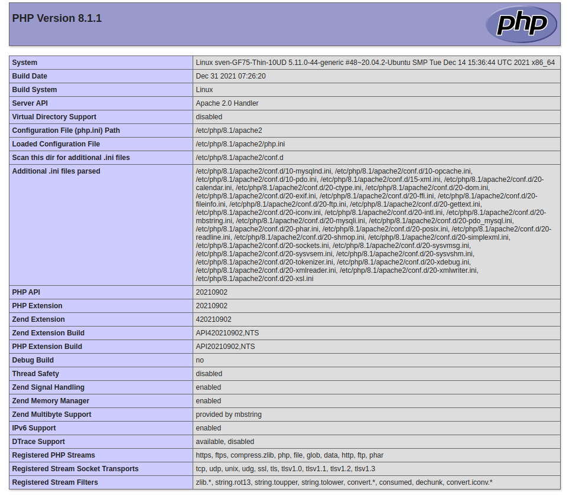
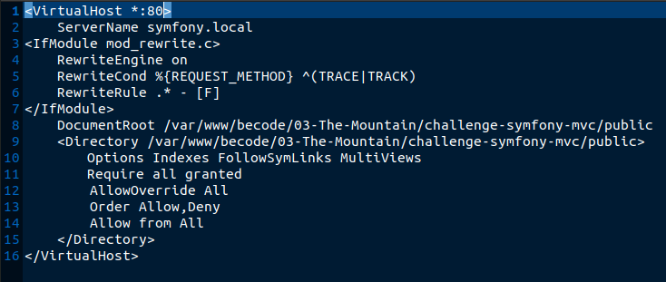
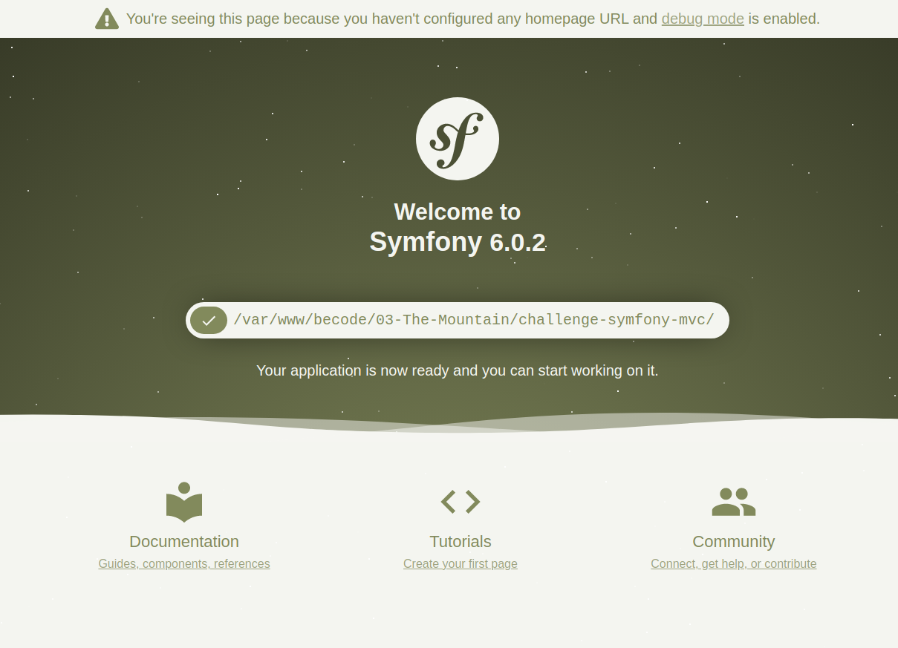

# Introduction to Symfony and MVC-routing <!-- Exercise title -->

<!-- ## published site -->

<!-- ## screenshot of user stories -->

<!-- ## link to the project board and tickets -->

### exercise in week 16 (10/01/2022 - 15/01/2022)<!-- NR (from date - to date)--> of our BeCode training
You can find the original exercise readme [by clicking here](https://github.com/becodeorg/ANT-Lamarr-5.34/tree/main/3.The-Mountain/Symfony/1.MVC-routing)

## Table of content

|     |                                                                         |
| --- | ----------------------------------------------------------------------- |
| 1   | [Challenge](#challenge)                                                 |
| 2   | [The objective of this exercise](#the-objective-of-this-exercise)       |
| 3   | [The group](#the-group)                                                 |
| 4   | [Tools and languages used](#tools-and-languages-used)                   |
| 5   | [Timeline](#timeline)                                                   |
| 6   | [What I learned from this exercise](#what-i-learned-from-this-exercise) |
| 7   | [To Do](#to-do)                                                         |
| 8   | [Installation Instructions](#installation-instructions)                 |
|     |

## 1. Challenge

Time for a new framework! After weeks of PHP we are getting started with one of its most popular frameworks,
namely, [Symfony](https://symfony.com/) (I will be using Symfony 6 throughout these exercises).
Our coaches have provided us with [a series of 3 exercises](https://github.com/becodeorg/ANT-Lamarr-5.34/tree/main/3.The-Mountain/Symfony) 
to get a basic understanding of how Symfony works and what it can do for us.  
In this first exercise we will be:
* installing Symfony
* installing Composer
* starting our first Symfony project
* configuring the routing for our local Vhost
* learning about version numbers and software lifecycles
* using the mvc model provided by Symfony
* adding some functionality to a Controller

## 2. The objective of this exercise

Start getting a feel for Symfony by going through a step by step exercises combined with ample documentation.

## 3. The group
<!--give credit where it's due and link to group member's github pages-->
This is a solo exercise
## 4. Tools and languages used

<!--Adjust the content of this table per exercise
Logos are added on a project basis, I have them stored in a separate folder locally, ready for copying-->

|                                           |                                             |                                             |
|-------------------------------------------|---------------------------------------------|---------------------------------------------|
|    |  |      |
|  |  |          |
|          |          |      |

## 5. Timeline
<!-- fill in the timeline with what happened, challenges and how you overcame them, little victories, link to sources if possible -->
- day 1(:date: 10/01/2022):
  - after the morning briefing by [coach Tim](https://github.com/Timmeahj) it's time to dive into Symfony
  - Since I already installed Symfony the weekend before (what can I say, I was excited to get my hands on this exercise!) I could take my time setting up the virtual host as requested.
  - I could just as easily use the built in `symfony server:start` command, but I wanted to figure out how to configure a vhost on my Apache server.
  - I kept getting this screen: 
  - It took  a good half hour for me to figure out how to configure my vhost and in the end it worked like this: 
  - After a quick `sudo service apache2 restart` I was greeted by the default Symfony landing page: 
  - It was time to make my first controller, thanks to the Symfony CLI I just had to use `symfony console make:controller`
  - I added `use Symfony\Component\Routing\Annotation\Route;` to the lineup in order to use annotations to declare my routes as explained [here](https://symfony.com/doc/current/page_creation.html#annotation-routes)
  - Next up came form integration,
    - first I created an entity called User using `symfony console make:entity`
    - then I made a form for this entity by using `symfony console make:form`
  - I then rendered that form in the homepage as detailed [here](https://symfony.com/doc/current/forms.html#rendering-forms)
  - Next up I made the form submission call the method changeMyName after giving the $user all it's data from the form
  - In changeMyName I then save the $user->name into the $session (I use the requestStack for this as explained [here](https://symfony.com/doc/current/session.html#basic-usage))
  - I pass the $session['userName'] to the view to render it on the page
  - I also set the `/change` route to only accept entry from a `method = 'post'`, that way users should only be able to get to that page after submitting a valid form entry.
  - Using the `path()` Twig helper I created links from home to about-me and back as explained [here](https://symfony.com/doc/current/reference/twig_reference.html#path)
  - By using the $session['userName'] I could pass the user's name along to the About page
  - I also made the about page forward the user to the homepage if the username is not known.
  - Step 6 said to change the url of the about-me page to about-becode, and since all previous steps were done correctly,this didn't break any of the links
  - all done :tada:

## 6. What I learned from this exercise
<!--here you can write anything from a short summary on the subject of the exercise, a readable description of the new skills/knowledge you acquire, to an in depth clarification. As long as it helps you retain what you learned, or easily find the information when working on future projects-->
following the steps in this exercise showed very clearly how Symfony implements the MVC model.
Having used vanilla PHP for my last project (scrum-challenge) makes me appreciate even more what Symfony can do out of the box.

## 7. To Do

This to do list is for personal use, the full to do list is added at the start of the challenge and as we complete
objectives they will be moved up into the timeline section and ticked off using emotes such as :heavy_check_mark:

<!--For now, this list is usually provided by BeCode and thus quite static. When working on outside projects, this list will become more dynamic as the projects grow and evolve-->

### must-haves

### Nice to have

* use the [Session bag](https://symfony.com/doc/current/components/http_foundation/sessions.html) instead of the native $_SESSION
  * :exclamation: I used the requeststack instead, since the session bag kept bugging out on me :heavy_check_mark:
* use a symfony form for the 'change name' form :heavy_check_mark:

## 8. Installation Instructions for developers

<!--write clear instructions on how to get your project working on the user's local environment-->
